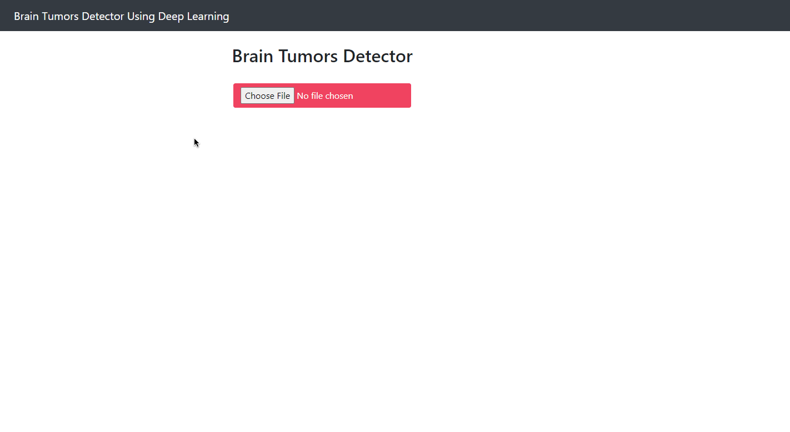

# Brain Tumors Detection

<div align="center">
<p>

</p>
<br>
<div>
</div>
</div>

## Introduction
This repository contains a deep learning model based on a convolutional neural network (CNN) used to detect brain tumors from MRI images. 

There are two pre-trained models in this repo :

1. Binary Cross entropy :  `BrainTumor10Epochs.h5` 
2. Categorical Cross Entropy : `BrainTumorCategorical10Epochs.h5`


## Before you run the model

1. Clone the repository recursively:

    * `gh repo clone hamza-safwan/Machine-Learning`
    * `cd Brain Tumor Detection`

2. Make sure that you fulfill all the requirements: Python 3.6.8 or later with all packages in `requirements.txt`

3. Run the model through flask application module : `app.py` in your terminal 

    ```
    python app.py
    ```

## Dataset 

1. Br35H : Brain Tumor Detection 2020
    * [Brain Tumor Detection Download Link](https://www.kaggle.com/datasets/ahmedhamada0/brain-tumor-detection)

    * Extract the images in `datasets` folder.
 
    * `pip install -r requirements.txt`
2. to train your custom model use `main_train.py` module.


